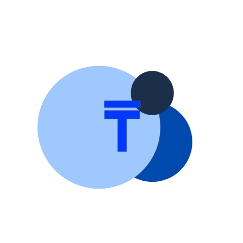

# Frontend Tribe - Light SaaS Landing Page Template

A modern, responsive SaaS landing page built with Next.js and Tailwind CSS.



## 🌟 Features

- **Modern Design**: Clean and professional layout optimized for SaaS products
- **Fully Responsive**: Optimized for mobile, tablet, and desktop experiences
- **Performance Optimized**: Fast loading with Next.js and optimized assets
- **Smooth Animations**: Elegant animations using Framer Motion
- **SEO Ready**: Built-in SEO structure for better search engine visibility
- **TypeScript Support**: Type-safe development with TypeScript
- **Easy Customization**: Simple structure for quick and easy customization

## 🚀 Tech Stack

- **Next.js 14** - React framework with server-side rendering
- **TypeScript** - Type-safe JavaScript
- **Tailwind CSS** - Utility-first CSS framework
- **Framer Motion** - Animation library
- **SVGR** - SVG handling for React components

## 📋 Sections

The template includes the following sections:

- **Header**: Navigation and CTA
- **Hero**: Main banner with animated 3D elements
- **LogoTicker**: Animated customer logos
- **ProductShowcase**: Product features with visual elements
- **Pricing**: Service tier options
- **Testimonials**: Client feedback with animated layout
- **CallToAction**: Final conversion section
- **Footer**: Site navigation and social links

## 🛠 Getting Started

### Prerequisites

- Node.js (version 18 or higher)
- npm or yarn

### Installation

1. Clone the repository:
```bash
git clone <repository-url>
cd frontend-tribe-light-saas-landing-page-template
```

2. Install dependencies:
```bash
npm install
# or
yarn
```

3. Run the development server:
```bash
npm run dev
# or
yarn dev
```

4. Open [http://localhost:3000](http://localhost:3000) in your browser to see the result.

## 🎨 Customization

### Styling

The template uses Tailwind CSS for styling. You can customize the design by editing:
- `tailwind.config.ts` - For theme configuration
- `src/app/globals.css` - For global styles and component classes

### Content

Update the content in the section components located in `src/sections/`:
- `Header.tsx` - Navigation menu and logo
- `Hero.tsx` - Main banner text and imagery
- `LogoTicker.tsx` - Client logos
- `ProductShowcase.tsx` - Product features
- `Pricing.tsx` - Pricing tiers
- `Testimonials.tsx` - Client testimonials
- `CallToAction.tsx` - Final CTA section
- `Footer.tsx` - Footer links and copyright

### Images

Replace the images in the `src/assets/` directory with your own.

## 📱 Responsive Design

The template is fully responsive with three breakpoints:
- Mobile: 375px and above
- Tablet: 768px and above
- Desktop: 1200px and above

## 🏗️ Project Structure

```
frontend-tribe-light-saas-landing-page-template/
├── public/
├── src/
│   ├── app/
│   │   ├── globals.css
│   │   ├── layout.tsx
│   │   └── page.tsx
│   ├── assets/
│   │   └── (images and SVGs)
│   ├── components/
│   │   └── (reusable components)
│   └── sections/
│       ├── CallToAction.tsx
│       ├── Footer.tsx
│       ├── Header.tsx
│       ├── Hero.tsx
│       ├── LogoTicker.tsx
│       ├── Pricing.tsx
│       ├── ProductShowcase.tsx
│       └── Testimonials.tsx
├── next.config.mjs
├── package.json
├── postcss.config.mjs
├── tailwind.config.ts
└── tsconfig.json
```

## 🚀 Deployment

This project can be easily deployed to Vercel:

```bash
npm run build
# or
yarn build
```

For detailed deployment instructions, visit [Next.js deployment documentation](https://nextjs.org/docs/deployment).

## 📄 License

This project is licensed under the MIT License - see the LICENSE file for details.

## 🙏 Credits

- Design and development by [Frontend Tribe](https://frontendtribe.com)
- Icons and SVGs from various sources with proper licensing
- 3D elements and illustrations included in the assets folder

---

© 2025 Frontend Tribe. All rights reserved.